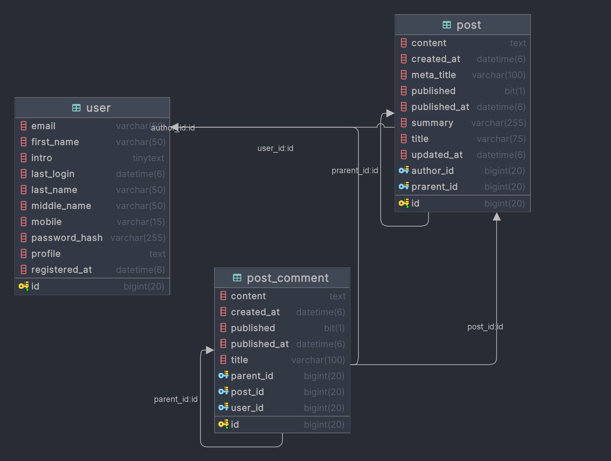
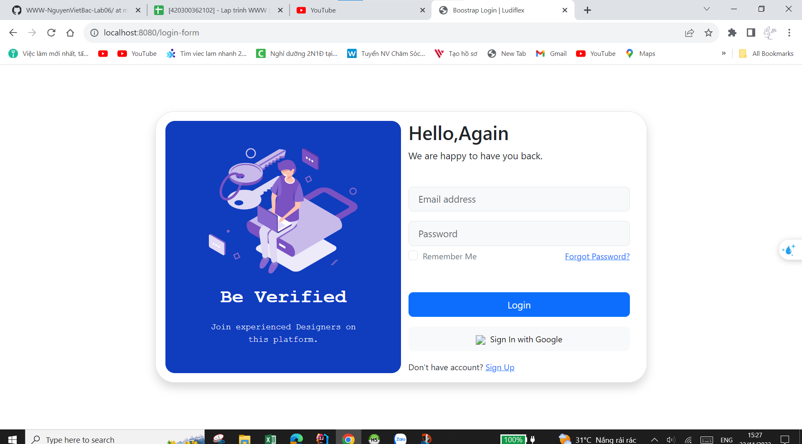
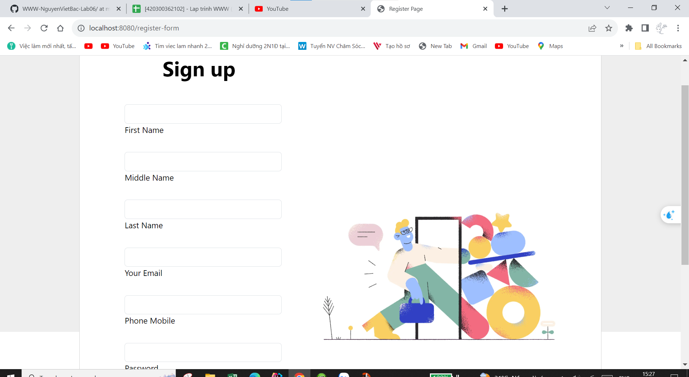
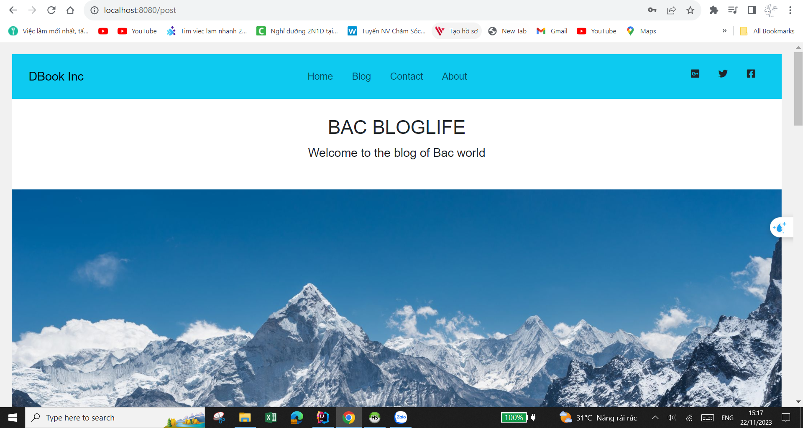
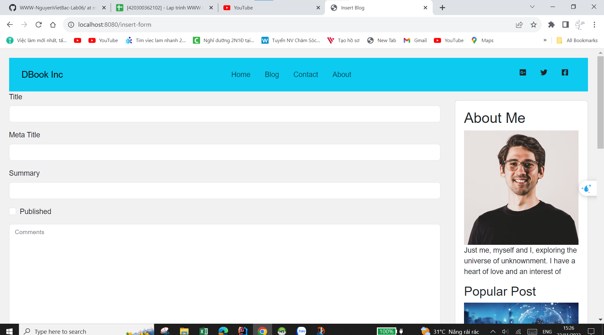
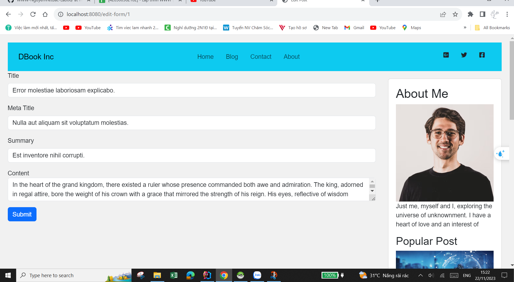

# WWW-NguyenVietBac-Lab06

# 💻 Công nghệ và công cụ sử dụng
     

### Database diagram 

### - Chức năng chương trình
+ Thêm bài post
+ Chỉnh sửa bài viết bài post
+ Bình luận cho bài viết
+ Đăng nhập 
+ Đăng ký
+ Sử dụng hài băm cho việc đăng ký và đăng nhập

### Các màn hình chương trình
 

